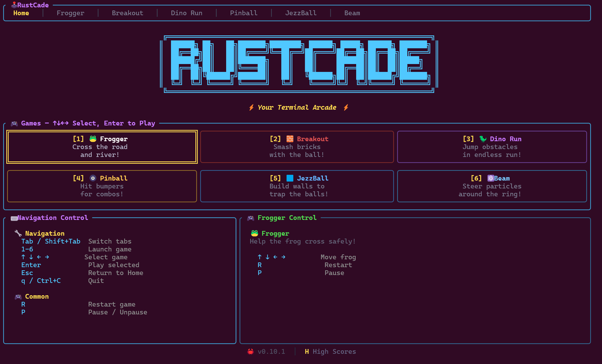

# 🕹️ Rust-Cade

A TUI-based arcade game suite built with [Ratatui](https://github.com/ratatui/ratatui). Play classic arcade games right in your terminal!




## 🎮 Games

| Game | Description |
|------|-------------|
| **Frogger** | Navigate traffic and ride logs across 13 lanes to reach the goal pads. |
| **Breakout** | Classic brick-breaking action with paddle, ball, colored bricks, lives, and increasing speed. |
| **Dino Run** | Chrome-style endless runner — jump and duck to dodge cacti and birds as speed ramps up. |
| **Pinball** | Terminal pinball with flippers, bumpers, spinners, and a multiball system. |
| **JezzBall** | Launch growing walls to partition space and trap bouncing balls. Progress through levels with more balls. |
| **Beam** | Particle beam simulation — tune magnets across 24 ring sections to keep a beam stable for 5 turns. Features bump mode, power supply ramps, and difficulty settings. |

## 📦 Installation

### From source

```bash
git clone https://github.com/bigsamich/rust-cade.git
cd rust-cade
cargo build --release
```

The binary will be at `target/release/rustcade`.

### Run directly

```bash
cargo run
```

## 🚀 Usage

Launch the arcade:

```bash
rustcade
```

## 🎛️ Controls

### Global

| Key | Action |
|-----|--------|
| `Tab` / `Shift+Tab` | Switch between game tabs |
| `Enter` | Start selected game |
| `1`–`6` | Quick-launch a game by number |
| `←` `→` `↑` `↓` | Navigate game tile grid on home screen |
| `H` | Toggle high scores display |
| `Esc` | Return to menu from any game |
| `Q` | Quit (from home screen) |
| `Ctrl+C` | Force quit |

### Common In-Game Controls

Every game shares these keys:

| Key | Action |
|-----|--------|
| `R` | Reset / restart |
| `P` | Pause / unpause |
| `Enter` or `Space` | Restart when game over |

---

### Frogger

| Key | Action |
|-----|--------|
| `↑` | Move frog up (toward goal, +10 pts) |
| `↓` | Move frog down |
| `←` | Move frog left |
| `→` | Move frog right |

### Breakout

| Key | Action |
|-----|--------|
| `←` | Move paddle left |
| `→` | Move paddle right |
| `Space` / `↑` | Launch ball |

### Dino Run

| Key | Action |
|-----|--------|
| `Space` / `↑` / `Enter` | Start game / Jump |
| `↓` | Duck (on ground) / Fast fall (in air) |

### Pinball

| Key | Action |
|-----|--------|
| `←` / `A` | Left flipper |
| `→` / `D` | Right flipper |
| `Space` / `↓` | Launch ball (plunger) |
| `T` | Tilt |

### JezzBall

| Key | Action |
|-----|--------|
| `↑` `↓` `←` `→` | Move cursor |
| `Space` / `Enter` | Place wall |
| `Tab` | Toggle wall direction (horizontal / vertical) |
| `Enter` / `Space` (level won) | Advance to next level |

### Beam

| Key | Action |
|-----|--------|
| `↑` / `↓` | Select magnet (or adjust bump trims in bump mode) |
| `←` / `→` | Adjust magnet power (or shift bump section in bump mode) |
| `]` / `[` | Jump to next / previous section |
| `+` / `=` | Double power step size (max 1.0) |
| `-` / `_` | Halve power step size (min 0.001) |
| `C` | Copy current section settings to all sections |
| `Z` | Zero selected magnet ramp value |
| `X` | Zero all ramp values in current section |
| `B` | Toggle bump mode |
| `Space` | Start beam |

## 🏗️ Project Structure

```
src/
├── main.rs          # Terminal setup & main loop
├── app.rs           # Application state & input routing
├── event.rs         # Async key/tick event handler (~30 FPS)
├── scores.rs        # High score persistence
├── ui/
│   ├── mod.rs       # Root UI renderer
│   ├── home.rs      # Home screen
│   └── tabs.rs      # Tab navigation bar
└── games/
    ├── mod.rs       # Game trait & registry
    ├── beam.rs      # Beam simulation
    ├── breakout.rs  # Breakout
    ├── dino_run.rs  # Dino Run
    ├── frogger.rs   # Frogger
    ├── jezzball.rs  # JezzBall
    └── pinball.rs   # Pinball
```

## 🛠️ Dependencies

- [**ratatui**](https://crates.io/crates/ratatui) `0.29` — Terminal UI framework
- [**crossterm**](https://crates.io/crates/crossterm) `0.28` — Cross-platform terminal manipulation
- [**rand**](https://crates.io/crates/rand) `0.8` — Random number generation

## 🔀 Cross Compiling

Rust-cade can be cross-compiled for different platforms using [`cross`](https://github.com/cross-rs/cross).

### Install cross

```bash
cargo install cross
```

### Build for a target

```bash
cross build --release --target <target-triple>
```

### Examples

```bash
# Linux ARM64 (Raspberry Pi 4, ARM servers)
cross build --release --target aarch64-unknown-linux-gnu

# Linux ARMv7 (Raspberry Pi 2/3, older ARM boards)
cross build --release --target armv7-unknown-linux-gnueabihf

# Windows (x86_64 via MinGW)
cross build --release --target x86_64-pc-windows-gnu

# macOS Apple Silicon
cross build --release --target aarch64-apple-darwin

# macOS Intel
cross build --release --target x86_64-apple-darwin
```

The binary will be at `target/<target-triple>/release/rustcade`.

### Tips

- Rust-cade is a pure terminal application with no native GUI dependencies, making it straightforward to cross-compile.
- All dependencies (`ratatui`, `crossterm`, `rand`) are pure Rust, so no C library cross-compilation is needed.
- You can list all available targets with `rustup target list`.

## 🤖 Built with Cline

This project is developed with [Cline](https://github.com/cline/cline) `v2.4.2` — an AI-powered coding assistant.

## 🤝 Contributing

Contributions are welcome! To add a new game:

1. Create a new file in `src/games/` implementing the game logic
2. Register it in `src/games/mod.rs`
3. Add a tab entry so it appears in the menu
4. Submit a pull request

## 📄 License

This project is open source. See the repository for license details.
